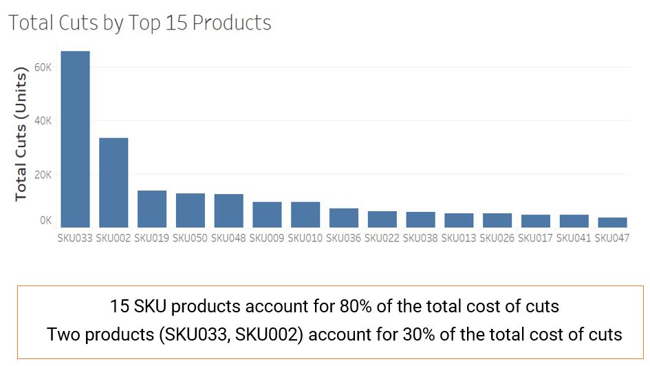
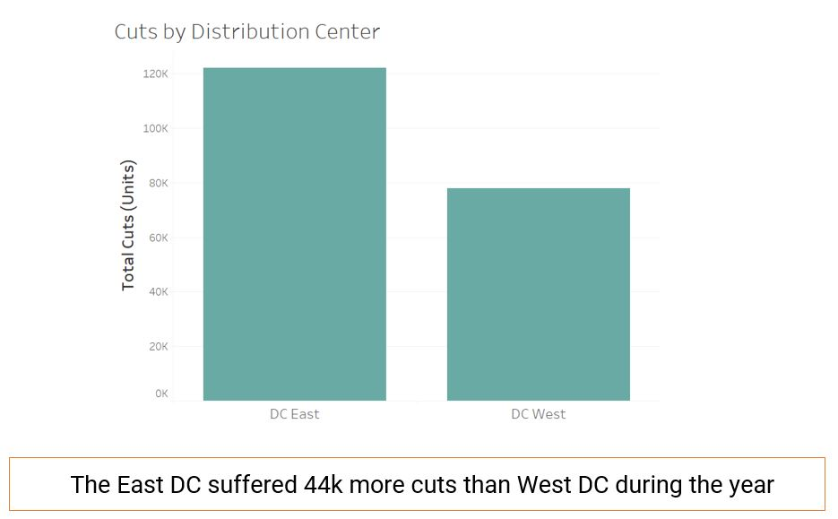
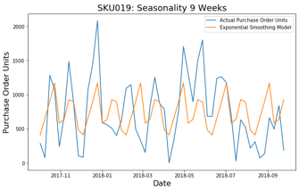

# Opex-project
Anomaly Order Detection and Response

# Main Objective
The main purpose of this project was to predict "cuts" where inventory does not meet demand.
The following analysis was done in order to forecast client's demand.

# Explatory Data Analysis

