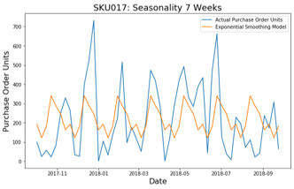

# Opex-competition
Anomaly Order Detection and Response

# Main Objective
The main purpose of this project was to predict times when inventory does not meet demand due to high influx of orders referred to as "cuts".

# Explatory Data Analysis
## Graph shows cuts over time 

## Products that has the most cuts

## Cuts by distribution center

## Cut drops by increasing inventory by fixed amount

## Seasonality

# Modeling
## Features created/used

* On Hand Inventory / Change of Inventory
* Pageview Out of Stock
* Average Price / Change of Price
* Consumer Ordered Units
* Forecast 1,4,8 Weeks 
* Difference in Forecast & Consumer Order Units

## Classification models & results
| |Logistic Regression | Randomforest | XGboost | 
|--- |------------- | ------------- | ------------- | 
| F-1 Score  | 0.6456 | 0.7122|  0.75|
